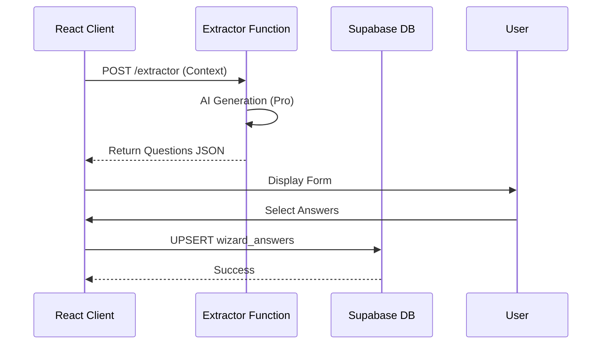

# PROMPT 09 — SUPABASE & EDGE FUNCTIONS IMPACT

**Role:** Backend Architect
**Goal:** Define the server-side logic required to power Screen 2.

---

## 1. EDGE FUNCTIONS

### `extractor` (The Core Function)
*   **Endpoint:** `/functions/v1/extractor`
*   **Method:** POST
*   **Input Body:**
    ```typescript
    {
      industry: string;
      selectedServices: string[];
      docInsights?: string; // Summary of uploaded PDFs
    }
    ```
*   **Logic:**
    1.  **Import:** Load `INDUSTRY_PACKS` from `_shared`.
    2.  **Prompt:** Construct prompt using Prompt 03 rules.
    3.  **Invoke:** Call Gemini 3 Pro with `responseSchema`.
    4.  **Validate:** Ensure returned `mapped_system_id`s exist in the system catalog.
    5.  **Return:** JSON `DiagnosticResponse`.

---

## 2. DATABASE SCHEMA (SUPABASE)

### Table: `wizard_answers`
Stores the user's selections from Screen 2.

| Column | Type | Description |
| :--- | :--- | :--- |
| `id` | uuid | PK |
| `session_id` | uuid | FK to `wizard_sessions` |
| `question_id` | text | e.g., "fashion_revenue_pain" |
| `answer_value` | jsonb | Array of selected strings |
| `metadata` | jsonb | Stores `mapped_system_id` and `priority_weight` |
| `created_at` | timestamp | |

### Table: `wizard_sessions`
Updates the current state.

| Column | Type | Update |
| :--- | :--- | :--- |
| `current_step` | int | Set to `2` |
| `step_data` | jsonb | Merges Step 2 data into the blob |

---

## 3. ROW LEVEL SECURITY (RLS)
*   **Policy:** `wizard_answers` can only be inserted/updated by the user who owns the `session_id`.
*   **Role:** Authenticated users (or Anon with Session ID token).

---

## 4. WIRING DIAGRAM

